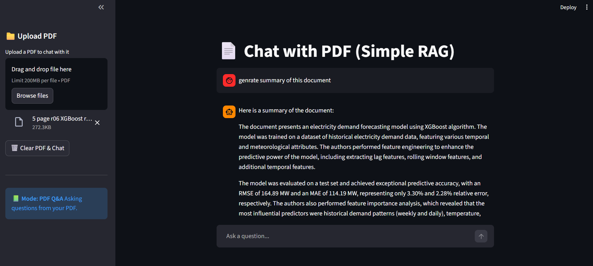

# Local RAG: Private Chat with your PDFs 📄🤖

### Description
A professional, local-first Retrieval-Augmented Generation (RAG) application built with **LangChain**, **Streamlit**, and **Ollama**. This project allows you to chat with your PDF documents privately on your own machine, with real-time performance tracking.

### Tech Stack
- **[LangChain](https://www.langchain.com/)**: Framework for LLM application development.
- **[Streamlit](https://streamlit.io/)**: For the interactive web interface.
- **[Ollama](https://ollama.ai/)**: For running large language models locally.
- **[ChromaDB](https://www.trychroma.com/)**: Fast, open-source vector database.
- **[FastEmbed](https://github.com/qdrant/fastembed)**: Efficient local embeddings generation.

### Features
- **Dual-Mode Chat**: 
  - 📗 **PDF Q&A Mode**: Ask questions specifically about your uploaded document.
  - 💬 **General Chat Mode**: Talk to the LLM directly for general knowledge without needing a PDF.
- **Local & Private**: Your data never leaves your machine. Everything runs locally using Ollama and FastEmbed.
- **Performance Tracking**: Built-in latency metrics showing time taken for Retrieval, LLM generation, and Total response time.
- **Modern UI**: Clean, ChatGPT-like interface built with Streamlit.
- **Session Management**: Chat history is preserved during your session.

### Screenshot


### How to Run

1.  **Ollama Setup**: Install from [ollama.com](https://ollama.com) and pull the Llama 3 model:
    ```bash
    ollama pull llama3
    ```

2.  **Clone & Install**:
    ```bash
    git clone https://github.com/riteshb040/RAG--Chatbot.git
    cd local-rag
    pip install -r requirements.txt
    ```

3.  **Run the App**:
    ```bash
    streamlit run main.py
    ```

---
*Created by [Ritesh Bavaliya](https://github.com/riteshb040) as a personal project to explore RAG and Local LLMs.*
